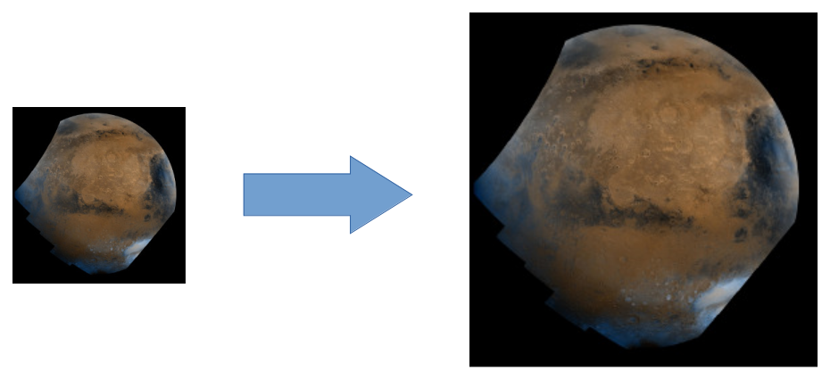

# A simple image filter example for those who study GPU/CUDA programming

Explore the performance advantages of GPU by example of bilinear image filter (increases image resolution by factor of two).



## Preparation

```bash
git clone https://github.com/dmikushin/bilinear.git
cd bilinear
wget https://photojournal.jpl.nasa.gov/jpeg/PIA00004.jpg
convert PIA00004.jpg PIA00004.bmp
```

Note we use very large input image e.g. from NASA space missions. The larger is an image, the greater is the chance to saturate the **massive parallelism** of many GPU cores, especially if the GPU is big, such as NVIDIA Volta V100 (which is used in the performance measurements below).


## Basic CUDA kernel

```CUDA
__device__ inline void interpolate(
	const RGBApixel* pixels, RGBApixel& output, int width, float x, float y)
{
	int px = (int)x; // floor of x
	int py = (int)y; // floor of y
	const int stride = width;
	const RGBApixel* p0 = &pixels[0] + px + py * stride; // pointer to first pixel

	// load the four neighboring pixels
	const RGBApixel& p1 = p0[0 + 0 * stride];
	const RGBApixel& p2 = p0[1 + 0 * stride];
	const RGBApixel& p3 = p0[0 + 1 * stride];
	const RGBApixel& p4 = p0[1 + 1 * stride];

	// Calculate the weights for each pixel
	float fx = x - px;
	float fy = y - py;
	float fx1 = 1.0f - fx;
	float fy1 = 1.0f - fy;

	int w1 = fx1 * fy1 * 256.0f + 0.5f;
	int w2 = fx  * fy1 * 256.0f + 0.5f;
	int w3 = fx1 * fy  * 256.0f + 0.5f;
	int w4 = fx  * fy  * 256.0f + 0.5f;

	// Calculate the weighted sum of pixels (for each color channel)
	int outr = p1.Red * w1 + p2.Red * w2 + p3.Red * w3 + p4.Red * w4;
	int outg = p1.Green * w1 + p2.Green * w2 + p3.Green * w3 + p4.Green * w4;
	int outb = p1.Blue * w1 + p2.Blue * w2 + p3.Blue * w3 + p4.Blue * w4;
	int outa = p1.Alpha * w1 + p2.Alpha * w2 + p3.Alpha * w3 + p4.Alpha * w4;

	output.Red = (outr + 128) >> 8;
	output.Green = (outg + 128) >> 8;
	output.Blue = (outb + 128) >> 8;
	output.Alpha = (outa + 128) >> 8;
}

__global__ void bilinear (const int width, const int height,
	RGBApixel* input, RGBApixel* output)
{
	int j = blockDim.y * blockIdx.y + threadIdx.y;
	int i = blockDim.x * blockIdx.x + threadIdx.x;
	
	if (j >= 2 * height) return;
	if (i >= 2 * width) return;

	float x = width * (i - 0.5) / (float)(2 * width);
	float y = height * (j - 0.5) / (float)(2 * height);

	interpolate(input, output[i + j * 2 * width], width, x, y);
}
```

```bash
cd unoptimized
make
./bilinear_cpu ../PIA00004.bmp
```

```
CPU kernel time = 0.897581 sec
```

```bash
cd unoptimized
make
./bilinear_gpu ../PIA00004.bmp
```

```
GPU kernel time = 0.003332 sec
```

Note that if we look into the generated GPU assembly, each pixel color component is loaded with an individual 1-byte LD instruction:

```
cuobjdump -sass bilinear_gpu | grep LD
        /*0358*/                   LDG.E.U8 R24, [R22+0x6] ;
```

## The effect of manual RGBA 4-byte coalescing

```CUDA
union RGBApixel_
{
	RGBApixel p;
	int i;
};

static __device__ __inline__ void interpolate(
	const RGBApixel* pixels, RGBApixel* output, int width, float x, float y)
{
	int px = (int)x; // floor of x
	int py = (int)y; // floor of y
	const int stride = width;
	const RGBApixel* p0 = &pixels[0] + px + py * stride; // pointer to first pixel

	// Load the four neighboring pixels
	RGBApixel_ p1_; p1_.i = *(int*)&p0[0 + 0 * stride];
	RGBApixel_ p2_; p2_.i = *(int*)&p0[1 + 0 * stride];
	RGBApixel_ p3_; p3_.i = *(int*)&p0[0 + 1 * stride];
	RGBApixel_ p4_; p4_.i = *(int*)&p0[1 + 1 * stride];

	const RGBApixel& p1 = p1_.p;
	const RGBApixel& p2 = p2_.p;
	const RGBApixel& p3 = p3_.p;
	const RGBApixel& p4 = p4_.p;
...
```

```bash
cd coalescing
make
./bilinear_gpu ../PIA00004.bmp
```

```
GPU kernel time = 0.002590 sec
```

Unlike the basic CUDA version, here thanks to the enforced 4-byte pixel loads, the GPU assembly dump now shows 4-byte LD instructions:

```
cuobjdump -sass bilinear_gpu | grep LD
        /*01d8*/                   LDG.E R7, [R10+0x4] ;
```

